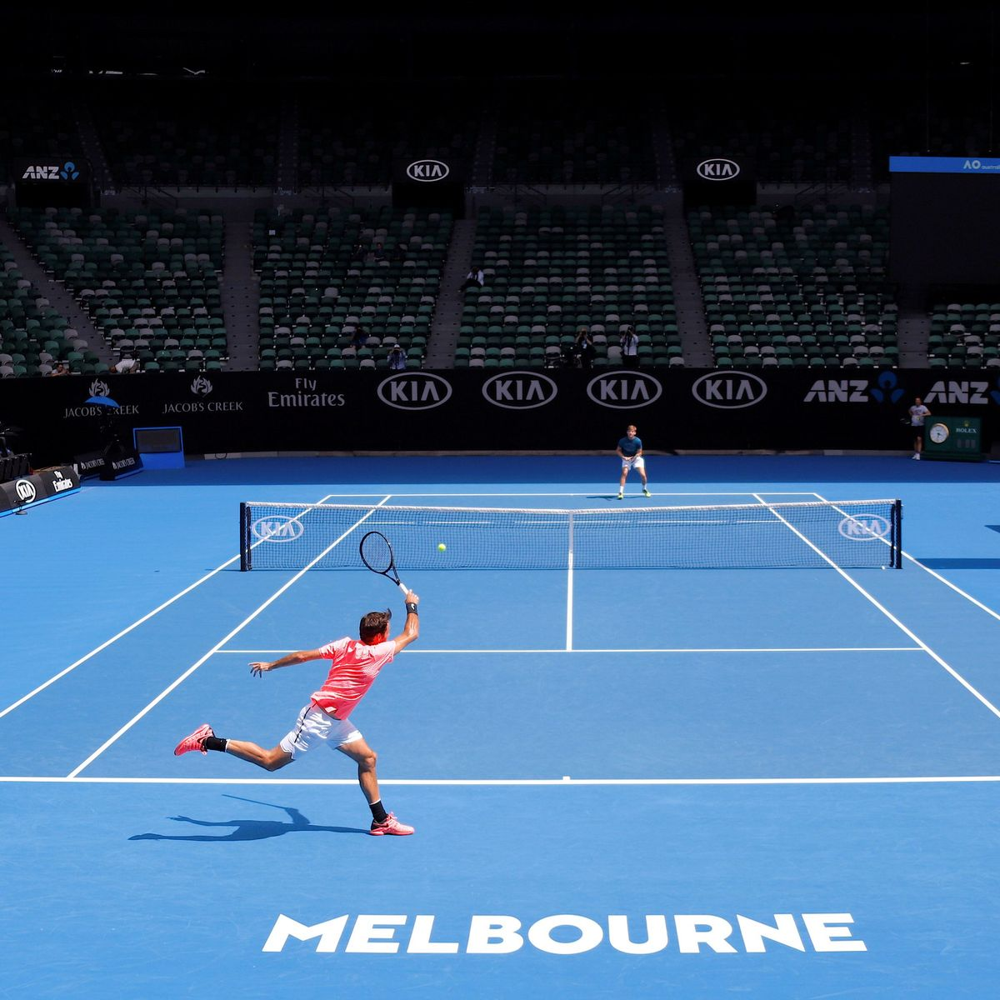
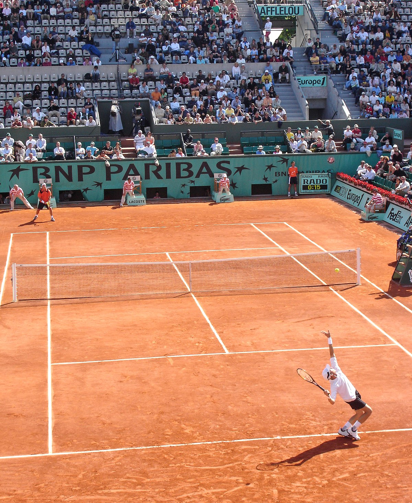

# Tipos de campo (superfícies)

  
  
  

<!--

  
  <figure>
    
    <figcaption>Dura (Australian Open)</figcaption>
  </figure>

  <figure>
    
    <figcaption>Saibro pó de tijolo (French Opeen)</figcaption>
  </figure>
  

-->
